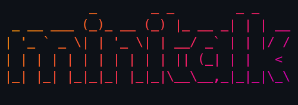

# minitalk

<p align="center">
    
</p>

<p align="center">This project is about communication between processes in a server-client model using exclusively 2 UNIX signals.</p>

---

<h3 align="center">Unix Signals</h3>
Signals are a tool used by the OS to stop a process, indicating a specific reason based on an event that has happened. For example, when you mess up your while loop and forget to increment the counter and end up with an infinite loop, you probably press CTRL + C to interrupt the execution, what is actually happening there is that the OS sent a signal called SIGINT (**SIG**nal **INT**errupt) to your process. Another common signal you encounter frequently but don't even know is a signal called SIGSEGV, or Segfault. It happens when you perform an illegal memory access, so the OS notices your infraction and immediately sends a signal to the process to interrupt it. 

To send a signal in C, we can use the `kill()` function, which will take two numbers, the first being the PID of the process and the next being the code for the Signal you want to send. PID stands for Process ID. It is an identification number bound to a process during its lifespan; it is the way we can identify a process in the system because two processes that are in execution at the same time can't share a PID, it will always be unique.

Example:
```c 
pid_t destiny_pid = 38919;
kill(destiny_pid, SIGINT);
```
In the above example, we determined the destiny process PID and sent it a SIGINT with the function `kill()`. The process with this PID will be terminated with the message of a SIGINT.

So, we know how to send signals, but how do we receive them? Actually, you don't need to do anything to receive it if you want to maintain the default behavior (which is terminating the program). But, if you want to perform specific actions when receiving a Signal, then we need to define a Signal Handler.

A Signal Handler is a function made to be performed when a Signal is received by the process:
```c
void    my_signal_handler(int sig)
{
    if (sig == SIGINT)
        printf("I received a SIGINT!");
    else
        printf("I received a SIGQUIT!");
}

int main(void)
{
    signal(SIGINT, my_signal_handler);
    signal(SIGQUIT, my_signal_handler);

    while (1)
        continue ;
}
```
In the above example, we use the function `signal()` to determine that the signals `SIGINT` and `SIGQUIT` will have the `my_signal_handler` function as a signal handler. This means that when this process receives one of these signals, it won't terminate; instead, it will run the function assigned as handler.

The `signal()` function only provides one piece of information about the signal, the signal code itself, and that may not be very useful, so the `sigaction()` function was invented. I do not understand `sigaction()` completely, but I know it can carry a lot more information about a signal than just the code, for example, you can set different flags for the received signal, and it can even carry a struct with one of the fields being the PID of the process that sent the Signal! That would be very useful if you wanted to create a bidirectional communication, wouldn't it?

The last topic I think this project is about is serialization, which is the process of converting data into a format that can be stored or transported. For example, when you send a message to a friend of yours, all your information is converted into electric waves or light waves to be transported through your internet cables until it reaches your friend's computer, and it is not being transmitted as characters, it is being transmitted as packages, which contain bytes, which contain bits, and so on.
